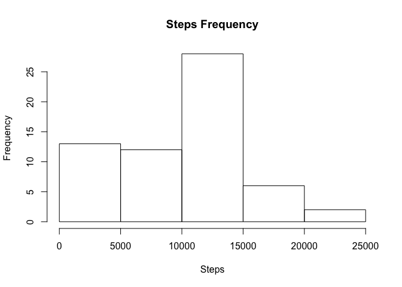
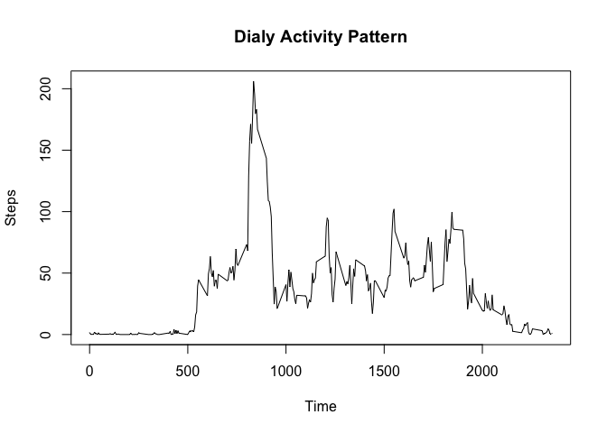
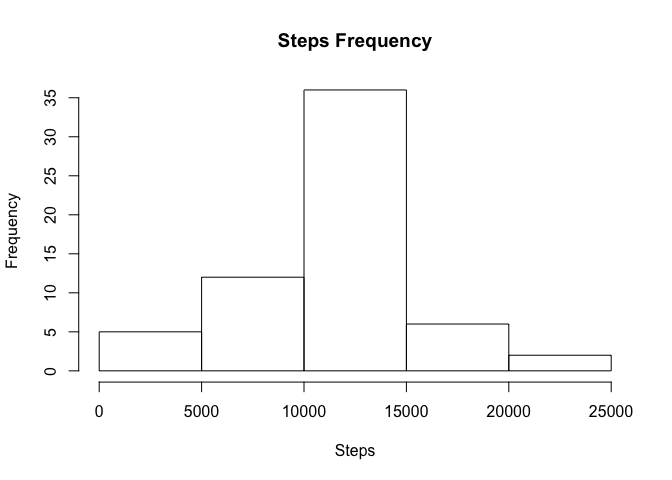
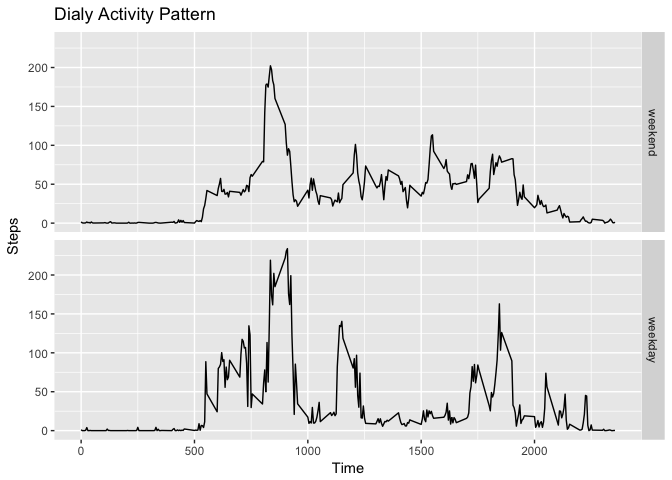

## Loading and preprocessing the data


```r
  ## unzip file and read data
  unzip("activity.zip")
  alldata<-read.csv("activity.csv")
  ## Transform date type
  alldata$date<-as.Date(alldata$date)
```

```
## Warning in strptime(xx, f <- "%Y-%m-%d", tz = "GMT"): unknown timezone
## 'zone/tz/2017c.1.0/zoneinfo/Asia/Shanghai'
```

## What is mean total number of steps taken per day

```r
  library("dplyr")
```

```
## 
## Attaching package: 'dplyr'
```

```
## The following objects are masked from 'package:stats':
## 
##     filter, lag
```

```
## The following objects are masked from 'package:base':
## 
##     intersect, setdiff, setequal, union
```

```r
  library("ggplot2")
  totalstepsbyday<-aggregate(alldata$steps,
                        by=list(Date=alldata$date),FUN=sum,na.rm=TRUE)
  names(totalstepsbyday)[2]<-"Steps"
```
## The total steps per day and the histogram

```r
  print(totalstepsbyday)
```

```
##          Date Steps
## 1  2012-10-01     0
## 2  2012-10-02   126
## 3  2012-10-03 11352
## 4  2012-10-04 12116
## 5  2012-10-05 13294
## 6  2012-10-06 15420
## 7  2012-10-07 11015
## 8  2012-10-08     0
## 9  2012-10-09 12811
## 10 2012-10-10  9900
## 11 2012-10-11 10304
## 12 2012-10-12 17382
## 13 2012-10-13 12426
## 14 2012-10-14 15098
## 15 2012-10-15 10139
## 16 2012-10-16 15084
## 17 2012-10-17 13452
## 18 2012-10-18 10056
## 19 2012-10-19 11829
## 20 2012-10-20 10395
## 21 2012-10-21  8821
## 22 2012-10-22 13460
## 23 2012-10-23  8918
## 24 2012-10-24  8355
## 25 2012-10-25  2492
## 26 2012-10-26  6778
## 27 2012-10-27 10119
## 28 2012-10-28 11458
## 29 2012-10-29  5018
## 30 2012-10-30  9819
## 31 2012-10-31 15414
## 32 2012-11-01     0
## 33 2012-11-02 10600
## 34 2012-11-03 10571
## 35 2012-11-04     0
## 36 2012-11-05 10439
## 37 2012-11-06  8334
## 38 2012-11-07 12883
## 39 2012-11-08  3219
## 40 2012-11-09     0
## 41 2012-11-10     0
## 42 2012-11-11 12608
## 43 2012-11-12 10765
## 44 2012-11-13  7336
## 45 2012-11-14     0
## 46 2012-11-15    41
## 47 2012-11-16  5441
## 48 2012-11-17 14339
## 49 2012-11-18 15110
## 50 2012-11-19  8841
## 51 2012-11-20  4472
## 52 2012-11-21 12787
## 53 2012-11-22 20427
## 54 2012-11-23 21194
## 55 2012-11-24 14478
## 56 2012-11-25 11834
## 57 2012-11-26 11162
## 58 2012-11-27 13646
## 59 2012-11-28 10183
## 60 2012-11-29  7047
## 61 2012-11-30     0
```

```r
  hist(totalstepsbyday$Steps,xlab="Steps",main="Steps Frequency")
```

<!-- -->


```r
  stepmean=as.integer(mean(totalstepsbyday$Steps,na.rm=TRUE))
  stepmedian=as.integer(median(totalstepsbyday$Steps,na.rm=TRUE))
```
### The mean of the total number of steps taken per day is 9354
### The median of the total number of steps taken per day is 10395


## What is the average daily activity pattern?

```r
  dailysteps<-aggregate(alldata$steps,
                        by=list(Interval=alldata$interval),FUN=mean,na.rm=TRUE)
  names(dailysteps)[2]="Steps"
  with(dailysteps,plot(Interval,Steps,type="l",main="Dialy Activity Pattern",
                       xlab="Time"))
```

<!-- -->

```r
   maxinterval<-which(dailysteps$Steps==max(dailysteps$Steps,na.rm=TRUE))
```
### The 835'th  inteval contains the maximum number of steps 

## Imputing missing values
## I fill in NA with the mean for that 5-minute interval

```r
  numofNA<-sum(is.na(alldata))
  ## another dataset
  filldata<-read.csv("activity.csv")
  filldata$date<-as.Date(filldata$date)
  ## fill with the mean for that 5-minute interval
  for(i in 1:nrow(filldata)){
    if(is.na(filldata[i,]$steps)){
      filldata[i,]$steps<-as.integer(dailysteps[((i %% 288)+1),]$Steps)
    }
  }
  totalstepsbyday<-aggregate(filldata$steps,
                        by=list(Date=filldata$date),FUN=sum,na.rm=TRUE)
  names(totalstepsbyday)[2]="Steps"
  hist(totalstepsbyday$Steps,xlab="Steps",main="Steps Frequency")
```

<!-- -->

```r
  stepmean=as.integer(mean(totalstepsbyday$Steps,na.rm=TRUE))
  stepmedian=as.integer(median(totalstepsbyday$Steps,na.rm=TRUE))
```
### The mean of the total number of steps taken per day is 10749
### The median of the total number of steps taken per day is 10641
### Obviously, Steps of some days increase because NA is filled with mean of intervals.
### So, the mean and median of the total number of steps taken per day increases.

## Are there differences in activity patterns between weekdays and weekends?

```r
  filldata<-mutate(filldata,weekend=factor(weekdays(date)>"星期五"
                                           ,labels = c("weekend","weekday")))
  weeksteps<-aggregate(filldata$steps,
                        by=list(Interval=filldata$interval,
                                Weekend=filldata$weekend),FUN=mean,na.rm=TRUE)
  names(weeksteps)[3]="Steps"
  qplot(Interval,Steps,data=weeksteps,facets=Weekend~.,
        geom="path",main="Dialy Activity Pattern",
                       xlab="Time")
```

<!-- -->

### You can see, the person walk less in weekends than in weekdays, especially 
### during rush hours.
